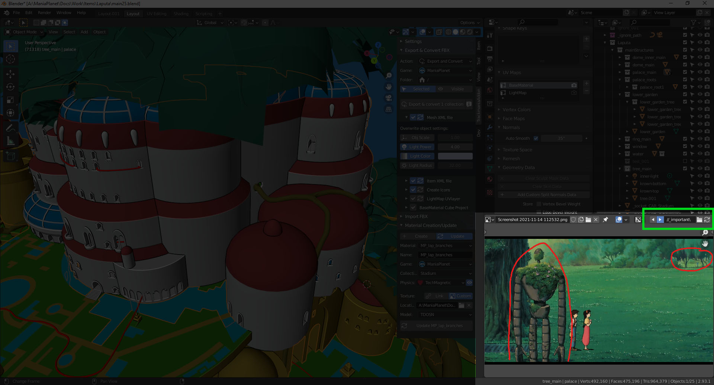

# blender-inspiro-slider
Use the image editor area as a slider: select a folder and then cycle easily through the images instead of selecting one by one 

__location__:\
in the header of any image editor area

__supports__:\
only one instance yet

__preview__:\

